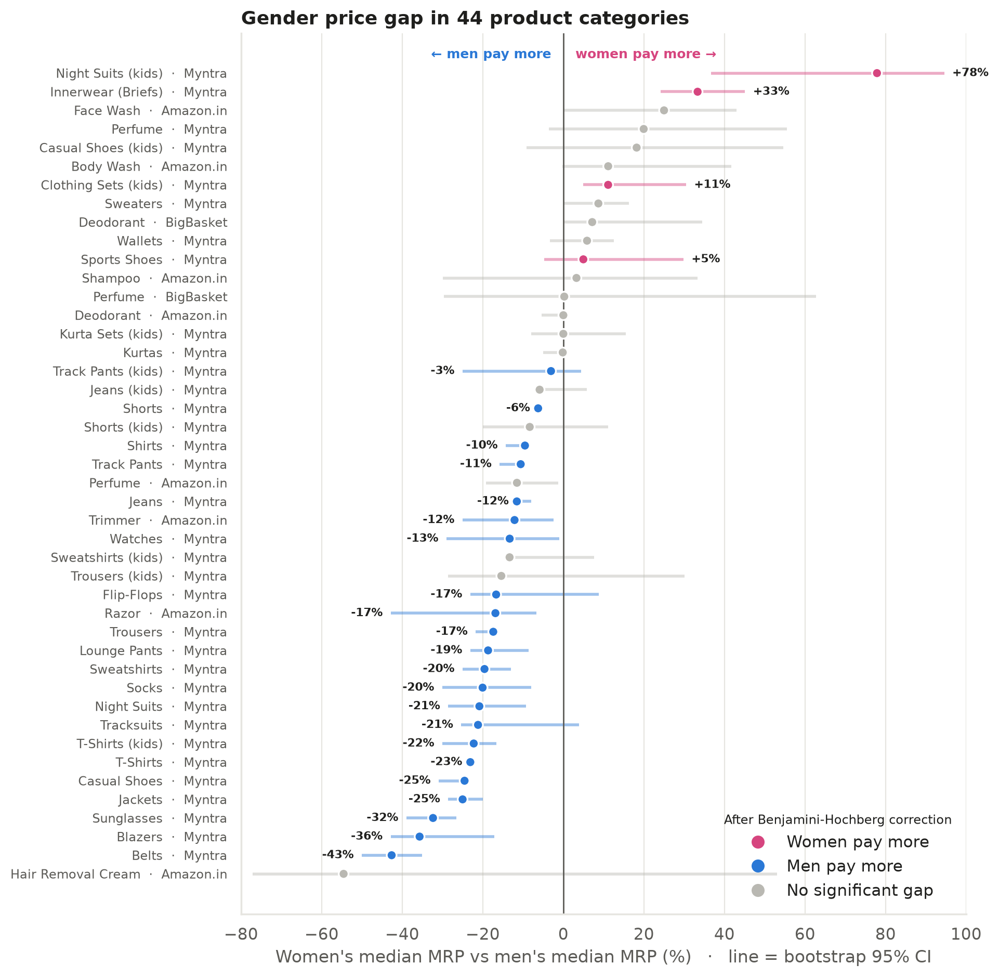
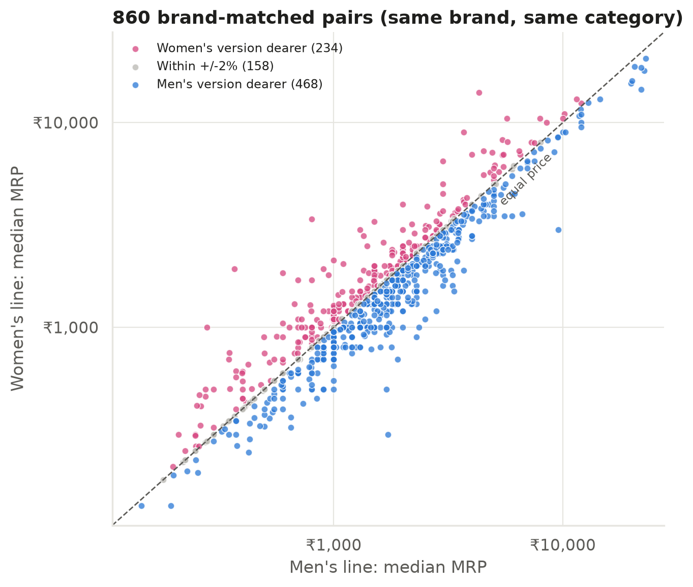
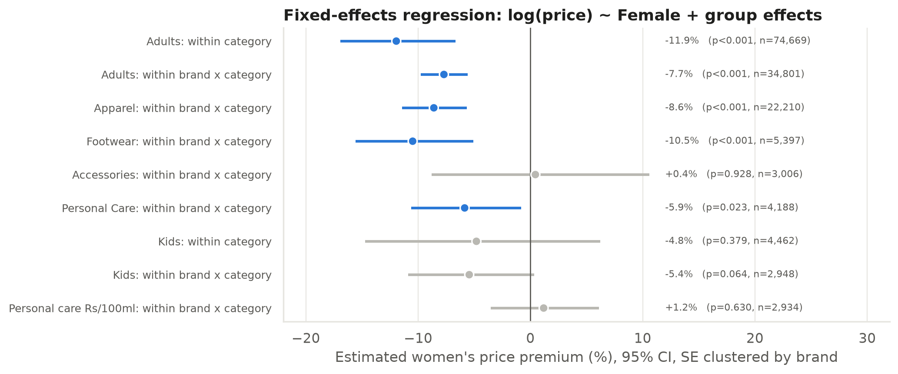
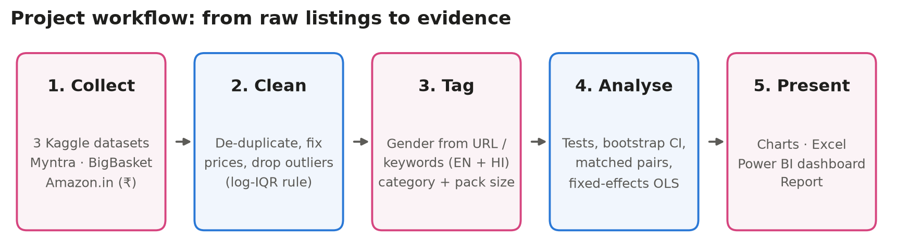

# PinkTax: is there a "Pink Tax" in Indian online retail?

[](https://colab.research.google.com/github/mppyxx/PinkTax/blob/main/notebooks/PinkTax_Analysis.ipynb)


**Author:** Kanishka Shah · Summer Internship (3170001), B.E. Computer Science & Engineering, SAL Engineering and Technical Institute (GTU) · Internal guide: Prof. Himani Patel

The **Pink Tax** is the idea that products marketed to women cost more than comparable products
marketed to men. This project tests that claim for India. It cleans, tags and statistically
compares **79,390 real product listings** (₹) from **Myntra, BigBasket and Amazon.in** across
**44 product categories** and **2,769 brands**.

> **Summary.** Indian online retail has **no blanket Pink Tax**. In most fashion categories, men's list
> prices are *higher*. The Pink Tax is real but **concentrated** in innerwear (+33%), girls' nightwear
> (+78%), kids' clothing sets (+11%) and women's sports shoes (+5%). Personal-care products show **no
> significant gap per 100 ml** once brand and pack size are held constant.

### Quick links

| | |
|---|---|
| 📄 Internship report | [PDF preview](report/PinkTax_Internship_Report.pdf) · [Word (.docx)](report/PinkTax_Internship_Report.docx) |
| 📓 Analysis notebook | [PinkTax_Analysis.ipynb](notebooks/PinkTax_Analysis.ipynb) · [Open in Colab](https://colab.research.google.com/github/mppyxx/PinkTax/blob/main/notebooks/PinkTax_Analysis.ipynb) |
| 📊 Excel workbook | [PinkTax_Analysis.xlsx](excel/PinkTax_Analysis.xlsx) |
| 📈 Power BI | [Build guide](powerbi/PowerBI_Build_Guide.md) · [DAX measures](powerbi/DAX_measures.dax) · [data model](powerbi/data) |
| 🧮 Results | [Charts](outputs/figures) · [Statistical tables](outputs/tables) · [Cleaned dataset](data/processed/pinktax_master.csv) |



---

## Key findings

| # | Finding | Evidence |
|---|---|---|
| 1 | Women pay significantly more in only **4 of 44** categories; men pay more in **22** | Mann-Whitney U with Benjamini-Hochberg FDR correction |
| 2 | Where the Pink Tax appears: **girls' night suits +78%**, **innerwear +33%**, **kids' clothing sets +11%**, **sports shoes +5%** (median MRP) | Bootstrap 95% CI excludes 0 |
| 3 | Same brand, same category: the women's line is dearer in **27%** of 860 pairs and the men's line in **54%**. The typical gap is **−5.9%** (95% CI −7.7% to −4.0%) | Wilcoxon signed-rank p < 0.001 |
| 4 | Fixed-effects regression within brand × category: women's items are **−7.7%** cheaper (adults, SE clustered by brand) | OLS, p < 0.001 |
| 5 | Personal care, like for like (₹ per 100 ml, within brand): **+1.2%, not significant** (p = 0.63) | Within-brand OLS |
| 6 | Kids look like a Pink Tax (+18% raw), but the gap **disappears within category** (−4.8%, p = 0.38). It comes from the category mix | Composition-effect check |
| 7 | Women's items carry **deeper discounts** (36.7% vs 32.9%), so the price actually paid differs from the MRP | Mann-Whitney p < 0.001 |
| 8 | Price depends on brand and category, not gender. Random-forest permutation importance is **0.97 for brand vs 0.02 for gender** | scikit-learn, test R² = 0.78 |

These results match recent research that finds no *systematic* premium for identical products,
with the gap coming from product differentiation instead (Moshary, Tuchman & Bhatia, 2021). The
larger gaps in earlier studies (for example NYC DCA, 2015) mostly compared differentiated products.

<p align="center">
  
  
</p>

---

## Data

| Source (Kaggle) | Products used | Segment |
|---|---|---|
| [Myntra 168k products](https://www.kaggle.com/datasets/ashishjangra27/myntra-168k-products) | 72,771 | Apparel, footwear, accessories, perfume (adults and kids) |
| [BigBasket product list](https://www.kaggle.com/datasets/surajjha101/bigbasket-entire-product-list-28k-datapoints) | 736 | Deodorant, perfume |
| [Amazon India products 2023](https://www.kaggle.com/datasets/asaniczka/amazon-india-products-2023-1-5m-products) | 5,883 | Deodorant, perfume, razor, trimmer, face / body wash, shampoo |

Gender is tagged from Myntra product URLs (`-men-`, `-women-`, `-boys-`, `-girls-`) and from English and
Hindi keywords in titles (`men`, `for her`, `पुरुषों`, `महिलाओं` …). Unisex, couple and multipack products are
excluded. Pack sizes (ml / g) are parsed from titles to compute ₹ per 100 ml.

## Method



1. **Cleaning:** de-duplication, zero-price removal, and outliers beyond 3 × IQR on log price within each category.
2. **Category test:** Mann-Whitney U, Welch t-test on log price, Cohen's *d*, 2,000-sample bootstrap CI and Benjamini-Hochberg correction.
3. **Unit price:** ₹ per 100 ml for liquids.
4. **Brand-matched pairs:** median women's line vs men's line for the same brand and category; Wilcoxon and sign tests.
5. **Fixed-effects OLS:** `log(MRP) = β·Female + brand×category effects`, with SEs clustered by brand.
6. **Discounts:** MRP gap vs selling-price gap.
7. **Machine learning:** random forest with permutation importance.

## Repository layout

```
PinkTax/
├── src/                       # the pipeline - run in order
│   ├── config.py              # paths, colours, chart style
│   ├── 01_download_data.py    # Kaggle -> data/raw/
│   ├── 02_clean_and_tag.py    # cleaning, gender + category tagging -> data/processed/
│   ├── 03_analysis.py         # statistical tests -> outputs/tables/
│   ├── 04_visualise.py        # Matplotlib / Seaborn charts -> outputs/figures/
│   ├── 05_build_excel.py      # Excel workbook -> excel/
│   ├── 06_ml_model.py         # scikit-learn model + Plotly chart
│   └── 07_powerbi_export.py   # Power BI tables, theme, layout -> powerbi/
├── notebooks/PinkTax_Analysis.ipynb   # full walk-through (Google Colab ready)
├── data/processed/            # cleaned master table (79,390 rows)
├── outputs/figures/           # 15 charts (PNG)
├── outputs/tables/            # every statistical result (CSV / JSON)
├── outputs/interactive/       # Plotly HTML chart
├── excel/PinkTax_Analysis.xlsx        # formulas, pivot summary, charts
├── powerbi/                   # data model CSVs, DAX measures, theme, build guide
├── report/                    # internship report: .docx (+ PDF preview), content.py, build_report.py
└── docs/screenshots/          # notebook / Excel screenshots used in the report
```

## Run it

```bash
pip install -r requirements.txt
cd src
python 01_download_data.py      # ~750 MB download, public Kaggle datasets
python 02_clean_and_tag.py
python 03_analysis.py
python 04_visualise.py
python 05_build_excel.py
python 06_ml_model.py
python 07_powerbi_export.py
```

You can also open the notebook in **Google Colab** using the badge above and choose *Runtime → Run all*.

To rebuild the internship report after editing `report/content.py`, run `cd report && python build_report.py --pdf`
(this needs LibreOffice for page numbering). You can also edit `report/PinkTax_Internship_Report.docx` directly in Word.

## Tools

Python (NumPy, Pandas, Matplotlib, Seaborn, Plotly, SciPy, Statsmodels, scikit-learn, OpenPyXL) ·
Google Colab / Jupyter · Microsoft Excel · Power BI · Git & GitHub

## Limitations

- Keyword gender tagging can mislabel a small share of titles. Spot checks were used to tune the rules.
- "Comparable" is approximated by same category (and same brand). Fabric, fit and design differences remain.
- Listings are snapshots from 2022–2023 and show listed prices, not sales volumes.
- Amazon brands are taken from the first word of the title.

## Authors

- **Kanishka Shah** – project author: research, data analysis, statistics, visualisation, Excel, Power BI and the internship report
  (B.E. Computer Science & Engineering, SAL Engineering and Technical Institute, GTU)
- **Prof. Himani Patel** – internal guide

To cite this project, use the **"Cite this repository"** button in the sidebar (generated from [`CITATION.cff`](CITATION.cff)).

## References

1. New York City Department of Consumer Affairs (2015). *From Cradle to Cane: The Cost of Being a Female Consumer.*
2. U.S. Government Accountability Office (2018). *Gender-Related Price Differences for Goods and Services* (GAO-18-500).
3. Moshary, S., Tuchman, A. & Bhatia, N. (2021). *Investigating the Pink Tax: Evidence Against a Systematic Price Premium for Women in CPG.* SSRN Working Paper.
4. Duesterhaus, M., Grauerholz, L., Weichsel, R. & Guittar, N. (2011). *The Cost of Doing Femininity: Gendered Disparities in Pricing of Personal Care Products and Services.* Gender Issues, 28, 175–191.
5. California Assembly (2022). *AB-1287 Price discrimination: gender* (Pink Tax repeal).
