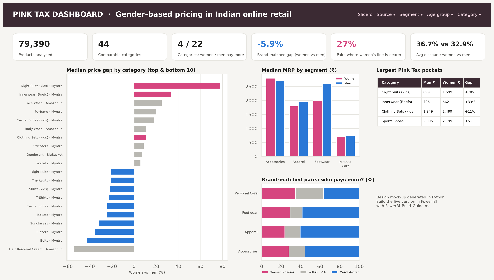

# Power BI dashboard: build guide

This guide rebuilds the Pink Tax dashboard in **Power BI Desktop** (free, Windows) in
about 30 minutes. Follow `dashboard_layout.png` for the layout.



## 1. Get the data

1. Run the pipeline (`python src/07_powerbi_export.py`), or use the CSVs already in `powerbi/data/`.
2. In Power BI: **Home → Get data → Text/CSV**. Load these four files:

| File | Role | Grain |
|---|---|---|
| `fact_products.csv` | Fact table | one row per product (≈79k) |
| `dim_category.csv` | Dimension | one row per source × age group × category |
| `category_premium.csv` | Results | one row per category (tests, CIs) |
| `brand_pairs.csv` | Results | one row per brand-matched pair |

3. In **Power Query** (Transform data), check the types:
   - `mrp`, `selling_price`, `discount_pct`, `unit_price_100`, `rating` → Decimal number
   - `product_id`, `category_key` → Text
   - Close & Apply.

## 2. Model (star schema)

In **Model view**, drag `dim_category[category_key]` onto:

- `fact_products[category_key]`: one-to-many, single direction
- `category_premium[category_key]`: one-to-one
- `brand_pairs[category_key]`: one-to-many

```
                 ┌───────────────────┐
                 │   dim_category    │
                 │ category_key (PK) │
                 │ source, segment,  │
                 │ age_group, cat.   │
                 └───┬─────┬─────┬───┘
            1:*      │     │1:1  │ 1:*
   ┌─────────────────┘     │     └──────────────┐
┌──▼────────────┐  ┌───────▼─────────┐  ┌───────▼──────┐
│ fact_products │  │category_premium │  │ brand_pairs  │
└───────────────┘  └─────────────────┘  └──────────────┘
```

Build slicers from `dim_category` so that they filter all three tables at once.

## 3. Measures

Create an empty table named `_Measures`, then add every measure from
[`DAX_measures.dax`](DAX_measures.dax) with **Modeling → New measure**. Format them as follows:

- `Pink Tax % …`, `… Dearer %`, `Share Women %`, `Avg Discount % …` → Percentage, 1 decimal
- `Median MRP …`, `Avg MRP …` → Currency ₹ (English (India)), 0 decimals

## 4. Theme

**View → Themes → Browse for themes →** `PinkTax_theme.json`. It sets women = pink `#D6457F`
and men = blue `#2A78D6`, the same colours as every Python chart.

## 5. Page layout (16:9)

| Area | Visual | Fields |
|---|---|---|
| Header | Text box + 4 slicers (dropdown) | `dim_category`: source, segment, age_group, category |
| KPI row | 6 × Card | `Products`, `Categories Tested`, `Categories Women Pay More` / `Men Pay More`, `Brand-matched Gap %`, `Pairs Women Dearer %`, `Avg Discount % (Women)` vs `(Men)` |
| Left | Clustered bar chart | Axis: `dim_category[category]`; Value: `Pink Tax % (median MRP)`; **Data colours → fx → Field value → `Pink Tax Colour`**; sort descending |
| Middle top | Clustered column chart | Axis: `dim_category[segment]`; Values: `Median MRP (Women)`, `Median MRP (Men)` |
| Middle bottom | 100% stacked bar | Axis: `dim_category[segment]`; Legend: `brand_pairs[outcome]`; Value: `Matched Pairs` |
| Right | Table | `category_premium`: category, median_men, median_women, premium_median_pct, p_adj_bh, direction; filter direction = "Women pay more" |

**Extra page (optional): "Per 100 ml".** Filter `fact_products[size_unit] = "ml"`. Add a clustered bar
with `category` against `Median Rs per 100ml (Women)` and `(Men)`, plus a card showing
`Pink Tax % (per 100ml)`.

**Tooltips.** Add `Products (Women)`, `Products (Men)` and `Pink Tax Label` to the tooltip well of the
category bar chart.

## 6. Publish / export

- **File → Save as** `PinkTax_Dashboard.pbix` and commit it to this folder.
- **File → Export → Export to PDF**, or take a screenshot, for the internship report.
